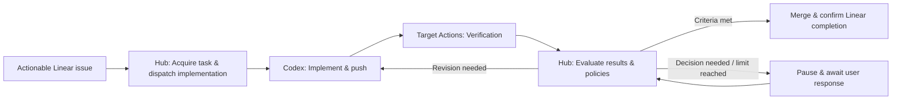

# Architecture

## Purpose and Scope

A single Hub manages multiple project connections. Each connection points to one GitHub repository and one Linear project. The number of internal modules within a repository is independent of this mapping.
The initial implementation begins with PR observation per connection.

## Responsibility Boundaries

| Component | Responsibility |
| --- | --- |
| Linear | Task specifications, acceptance criteria, dependencies, user judgment |
| Hub Core Gate | External state interpretation, next action decisions, deduplication, retries, pause/resume |
| Hub Project Policy | Required workflows/jobs, concurrency limits, review and merge criteria |
| Codex Execution Dispatch | Self-contained implementation/revision requests and execution outcome correlation |
| Target Repo Actions | Runtime and dependency installation, test environments (e.g. databases), lint/test/build |
| Target Repo | Development guidelines, tests, project-specific quality standards |

Hub does not checkout target repositories to run arbitrary verification commands.
Project-specific conditions must be expressed through CI checks or review guidelines.
Reusable environment setup is provided via templates, and later through version-pinned reusable workflows.
Branching gates based on repository names or introducing a custom pipeline language are excluded from the initial scope.

## Progression Model

The target pipeline is structured as follows. The current implementation scope covers the CI observation stage.

Scheduled tasks inspect the current state, perform bounded necessary actions, and exit immediately.
They do not keep HTTP requests open waiting for long-running Codex executions or CI completions.
The initial version relies on periodic polling; later, event webhooks and periodic recovery will feed into the same observation and evaluation path.

## State Ownership

- `ScheduleConfig` / `ScheduleJob`: When to observe and the single tick execution result.
- Current `TaskState`: The latest read-only observation report. Not an execution history or permanent audit log.
- Future `ProjectConnection`: The persistent model for repo ↔ Linear project mappings and policies.
- Future `PipelineRun` / Execution Attempt: State spanning issue to PR completion, request IDs, retry and recovery logs.
- GitHub: Source of truth for PR heads, check runs, and actual merge status.
- Linear: Source of truth for task contents, dependencies, and user status changes. Hub synchronizes required operational state.

In the initial stage, connection configuration resides in `ScheduleConfig.payload` rather than dedicated project CRUD models.
`linear_project_id` serves as connection identification metadata; existence and uniqueness are not yet validated against the Linear API.
When the project model is introduced, this payload will be migrated.

## Prerequisites Before Introducing External Writes

Read-only observation stores only the latest report containing timestamps and observed targets.
Because overlapping observations can overwrite earlier runs with later-finishing results, observation alone must never serve as justification for merges.

When introducing external writes:
- Lease mechanisms at the repo/issue/action level and unique idempotency request identifiers must be recorded in the DB.
- PostgreSQL's `FOR UPDATE SKIP LOCKED` during schedule selection only controls schedule selection—it does not guarantee exactly-once execution against external APIs.
- Even if a process crashes after an external request succeeds but before the DB commit, it must be able to query and resume existing PRs and requests.
- Never run concurrent, competing progression gates inside GitHub Actions.

Immediately prior to merging, the latest PR head and base, required checks, reviews, and branch protection rules must be re-verified.
Automatic merges must not rely solely on CI passing at the time of an earlier observation.

## Elements Adopted from g-sandbox

We adopt principles such as the PR snapshot → decision structure, missing task reclamation, bounded revision counts, pause/resume semantics, and reuse of existing PRs/requests.
However, `notes/*.md` project discovery, Godot installation / direct execution of `check.sh`, planning/prototype/maturity policies, and repo-specific marker compatibility are not part of the core migration scope.
